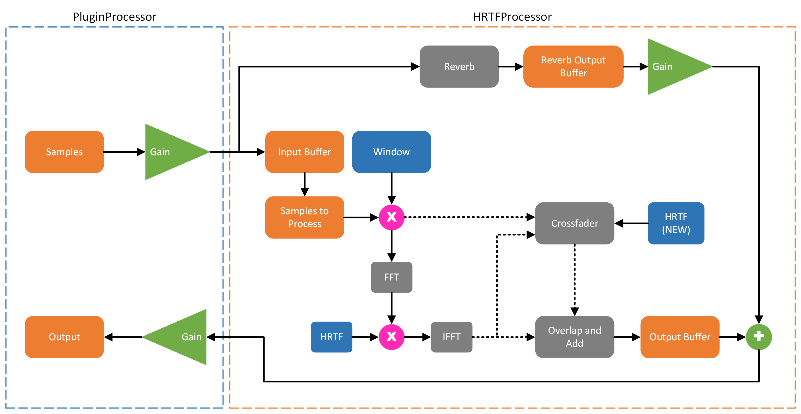

# ASE-Project Group 1 Final Project: Rust Spatializer

## User Documentation
**Github Pages Link:** [luheehk.github.io](https://luheehk.github.io/) (Including build instructions)

**Github Repo Link for User Documentation:** [luheehk.github.io.git](https://github.com/luheehk/luheehk.github.io.git)

## Demo Video Link
[Rust Spatializer GUI Demo Video](https://gtvault-my.sharepoint.com/:v:/g/personal/jxu692_gatech_edu/EZJFZ_ealwZHu_XDWqT99rsBGoKCtSbm-X8n4K45jIl8dQ?e=80Lbvw) \
[Rust Spatializer VST Demo Video](https://drive.google.com/file/d/1zGsT2UuuLcQXRDBh_YgObDkU8e3XNd6d/view?usp=sharing)

## Building
```shell
cargo xtask bundle ase-project --release
```

## Motivation
Spatial audio enhances listeners' experiences, providing a more realistic and immersive audio environment. This technology holds the potential to benefit listeners across various industries. As more advanced spatial computing emerges, spatial audio becomes instrumental in elevating the user experience of these products even further.

## Problem to be solved
We want to develop an audio effect software incorporating sound localization and reverberation to simulate spatial characteristics. We intend to maintain the input and output in binaural format, which, in comparison to ambisonics, has restricted dimensions for spatial audio. However, the spatial audio effect can be achieved by doing binaural panning, determining the distance and depth of audio sources, and applying realistic room acoustics for reverberation.

Our preliminary objective is to build a plugin that supports OSC control in REAPER. If time permits, we also plan to integrate this plugin into Unity to support position/orientation data from a 3D environment.

## Need for this project
* 3D binaural synthesis
* Room acoustic convolution reverb
* GUI for the users

## Applications
* Game development (sound design)
* Music Production
* AR/VR

## Functionality/Differentiation
We want to design software comparable to the state-of-the-art spatializer dearVR PRO 2 developed by Dear Reality. It can handle multiple types of input formats such as multi-channel, binaural, and Ambisonics. It also has multiple functionalities, such as stereo width control, selectable acoustic environments, reflection effects, and HP/LP filters for effects. Our goal is to include the stereo width, and acoustic environments functionality in our software. To set ourselves apart from dearVR PRO, we plan to allow users to input their own recorded impulse response, enabling them to create personalized reverberation within acoustic environments.

## Implementation
1. Input Audio Processing
    * Multi-Channel Format Conversion (mono input → stereo output)
    * Block processing
        * Overlap and add
    * OSC input and control

2. Spatial Rendering
    * ILD (Interaural Level Differences), ITD (Interaural Time Differences)
    * Filter Processing head related transfer functions (HRTFs), HRTF with room reverb encoded (BRIR)
        * Extracting measurement from SOFA (spatially oriented format for acoustics) file: https://docs.rs/sofar/latest/sofar/
        * Process HRTF: https://docs.rs/hrtf/latest/hrtf/
3. Reverberation Rendering
4. User Interface Interaction
    * VST in rust: https://github.com/RustAudio/vst-rs
    * https://www.seventeencups.net/posts/writing-an-audio-plugin-in-rust/

## System Flowchart
 \
Reference: [Orbiter](https://github.com/superkittens/Orbiter)

## References (algorithmic)
* https://docs.rs/ambisonic/latest/ambisonic/
* Rust playback library (include spatial audio effect):
  * https://docs.rs/rodio/latest/rodio/source/struct.Spatial.html
  * https://docs.rs/kira/latest/kira/spatial/index.html
* C. Mittag, M. Böhmeand S. Werner, “Dataset of KEMAR-BRIRs measured at several positions and head orientations in a real room”. Zenodo, Dec. 16, 2016. doi: 10.5281/zenodo.206860.
  * https://zenodo.org/records/206860#.XzygXy0ZNQI

* Pyroomacoustics: https://pypi.org/project/pyroomacoustics/0.1.4/

* C. Tsakostas, A. Floros, and Y. Deliyiannis, ‘Binaural rendering for enhanced 3d audio perception’, Proc. Audio Mostly, 2007.
* A. Floros and N.-A. Tatlas, ‘Spatial enhancement for immersive stereo audio applications’, in 2011 17th International Conference on Digital Signal Processing (DSP), 2011, pp. 1–7.

## Work Assignments
* Audio processing
* Spatial rendering
* Reverberation Rendering
* Implementing the user interface
